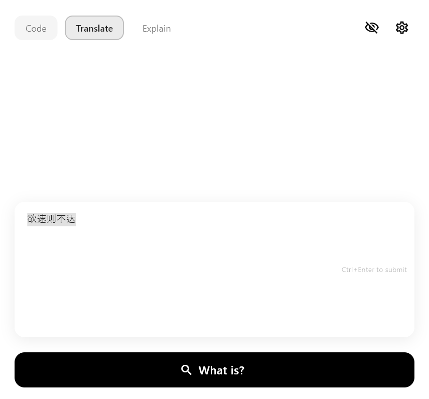
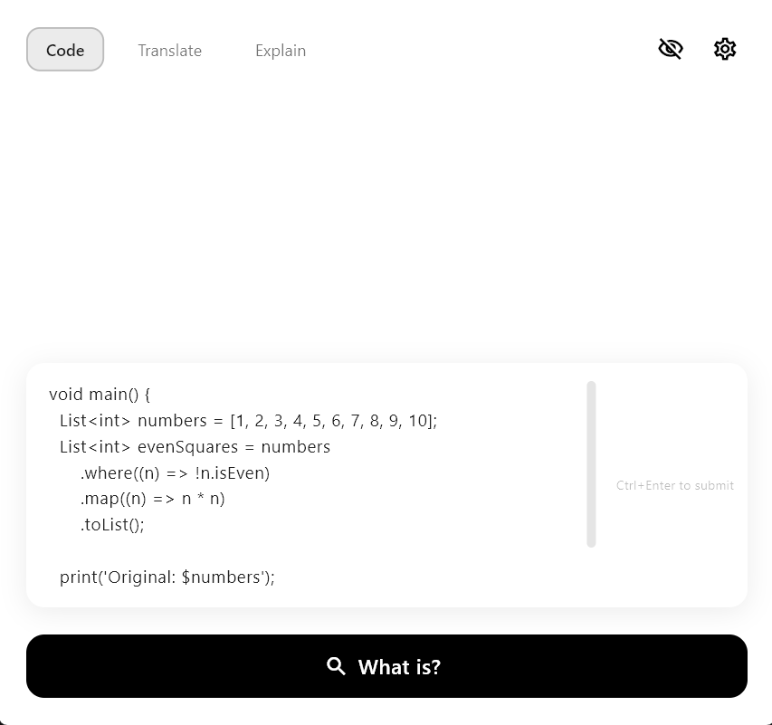
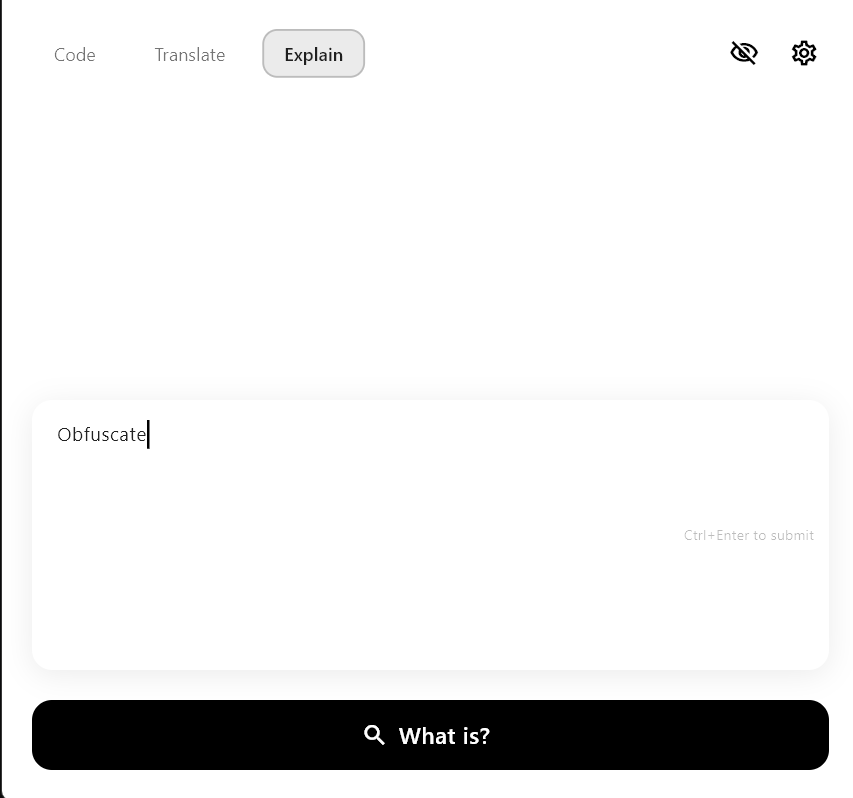
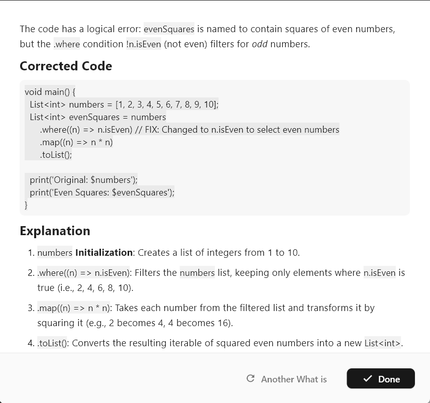

# What is

  
   
   
  
  **Your intelligent, keyboard-centric AI companion for Windows.**
  
   
  
  
  
  

---

**What is** is a powerful, minimalist utility tool designed to bring AI capabilities directly to your fingertips without breaking your flow. Whether you need a quick code snippet, a translation, or a complex concept explained, **What is** is just a hotkey away.

Built with a focus on speed and productivity, it sits quietly in your system tray and wakes up instantly when you need it, offering a sleek, monochrome interface that fits perfectly into any professional workflow.

## 📸 Screenshots

  
  
    
  
  

## ✨ Key Features

### 🚀 Instant Access & Workflow
*   **Global Hotkeys**: Summon the app from anywhere.
*   **Smart Clipboard Action**: Instantly paste your clipboard content, select it for editing, and get answers with a single shortcut.
*   **Auto-Focus & Select**: The input field is always ready. Text is auto-selected on entry, making it effortless to overwrite previous queries.
*   **System Tray Integration**: Minimizes unobtrusively to the background. Right-click for quick controls.

### 🎓 Learn It
*   **Topic Management**: Organize your learning journey into specific topics.
*   **AI Discussions**: Have focused, persistent conversations about your topics to deepen understanding.

### 🧠 Three Specialized Modes
*   **Code Mode**: Optimized for programming queries, snippets, and debugging help.
*   **Translate Mode**: Quick, accurate translations to your preferred target language.
*   **Explain Mode**: Deep dives into concepts, definitions, and general knowledge.

### 🎨 Sleek & Customizable
*   **Pro Monochrome Theme**: A high-contrast, distraction-free black and white design that adapts to your system's light or dark mode.
*   **Fully Configurable Hotkeys**: Don't like the defaults? Remap any action to your preferred key combination (Ctrl, Alt, Shift, Meta) directly in Settings.
*   **Personalized AI**:
    *   Choose your **AI Provider** (Google Gemini supported).
    *   Set your **Target Language** for responses.
    *   Define your **Response Style** (Concise, Detailed, Normal).

## ⌨️ Default Shortcuts

| Action | Default Hotkey | Description |
| :--- | :--- | :--- |
| **Code Mode** | `Ctrl` + `Alt` + `C` | Opens app in Code mode. |
| **Translate Mode** | `Ctrl` + `Alt` + `T` | Opens app in Translate mode. |
| **Explain Mode** | `Ctrl` + `Alt` + `E` | Opens app in Explain mode. |
| **Paste & Analyze** | `Ctrl` + `Alt` + `V` | Pastes clipboard content and focuses app. |
| **Hide App** | `Esc` | Hides the window instantly. |

*Note: All hotkeys can be customized in the Settings menu.*

## 🛠️ Installation

1.  Download the latest release installer.
2.  Run the setup executable.
3.  Launch **What is**.
4.  Follow the onboarding guide to set up your API key.

## ⚙️ Configuration

Access the **Settings** menu by clicking the gear icon in the top-right corner or via the system tray context menu.

*   **API Key**: Enter your Google Gemini API key securely.
*   **Languages**: Set your preferred output language and translation target.
*   **Hotkeys**: Toggle specific shortcuts on/off or click to record new combinations.

## 🏗️ Built With

*   [Flutter](https://flutter.dev) - UI Toolkit
*   [Window Manager](https://pub.dev/packages/window_manager) - Desktop Window Control
*   [Hotkey Manager](https://pub.dev/packages/hotkey_manager) - Global Shortcuts

## 🖥️ Supported Platforms & AI

*   **Platform**: **What is** is available for **Windows**, **Android**, and **Web** (Learn It feature not available on Web).
*   **AI Provider**: The application is powered by **Google AI (Gemini)**, **OpenAI**, **Claude (Anthropic)**, **DeepSeek**, and **AWS Bedrock**.

## 🚀 Roadmap (Coming Soon)

*   [ ] macOS and Linux support.
*   [x] Support for additional AI providers (OpenAI, Claude, DeepSeek, AWS Bedrock).
*   [ ] Chat history and session management.
*   [ ] Voice input support.
*   [ ] Plugin system for extended capabilities.

## 🤝 Contributing

Contributions are what make the open-source community such an amazing place to learn, inspire, and create. Any contributions you make are **greatly appreciated**.

1.  Fork the Project
2.  Create your Feature Branch (`git checkout -b feature/AmazingFeature`)
3.  Commit your Changes (`git commit -m 'Add some AmazingFeature'`)
4.  Push to the Branch (`git push origin feature/AmazingFeature`)
5.  Open a Pull Request

## 📝 License

Distributed under the MIT License. See `LICENSE` for more information.

---

  Made with ❤️ by wisam idris.

